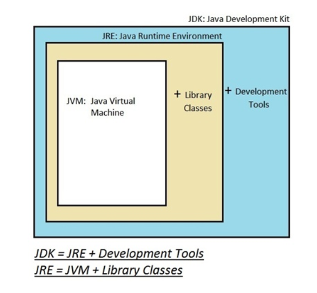
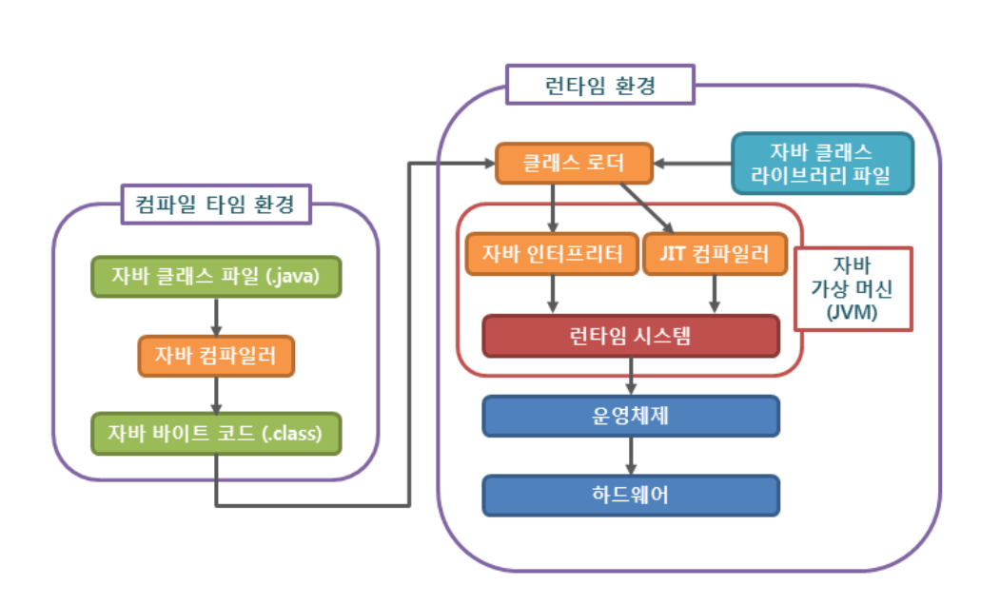
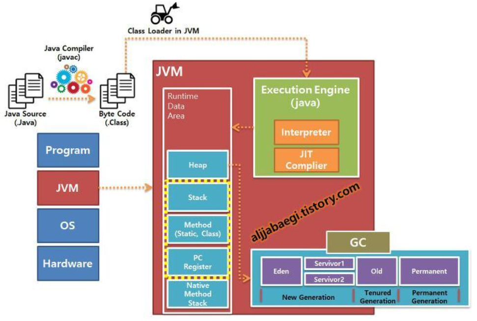
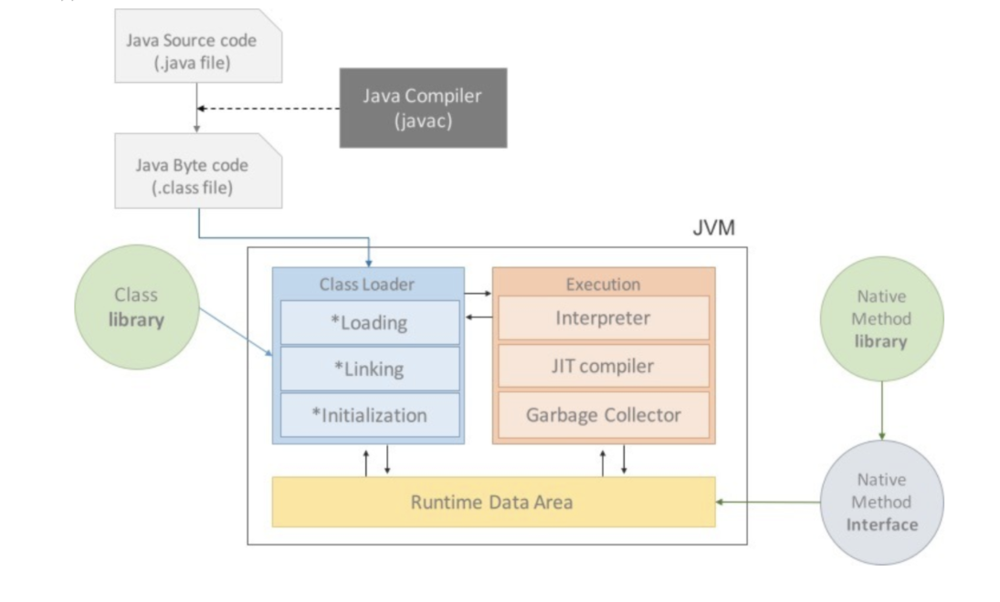
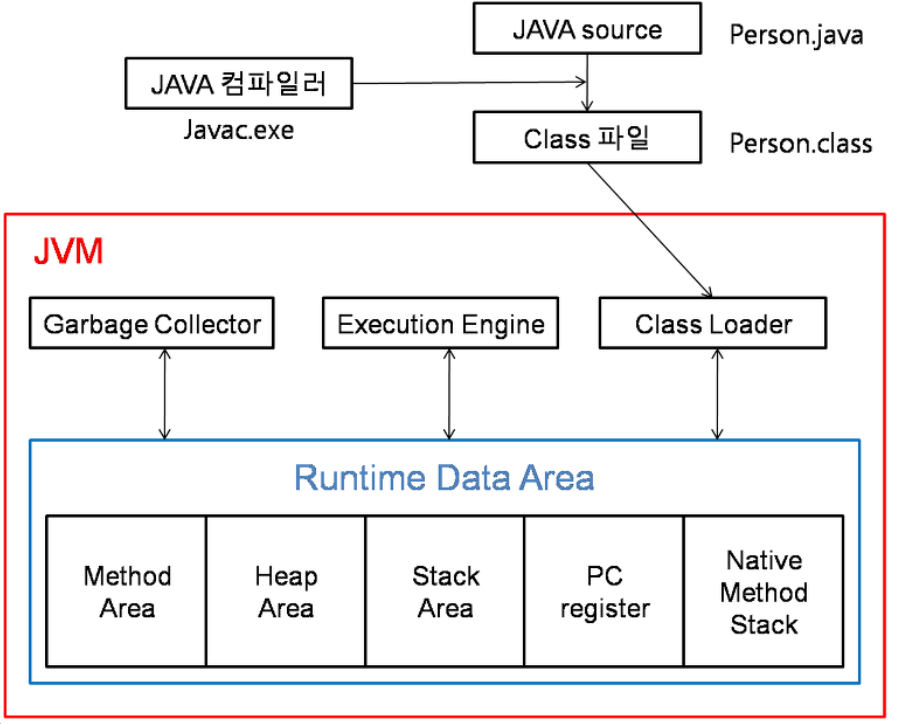
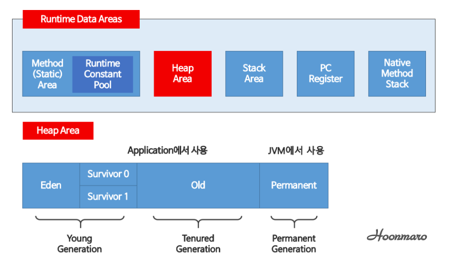

## 자바 Application과 일반 Application

### 자바 Application과 일반 Application

- 일반 application은 os와 바로 맞붙어 있어 os 종속적이다 (다른 os에서 실행시키기 위해선, application으로 os에 맞춰 변경해야함)
- 자바 application은 jvm하고만 상호작용하기 때문에 os와 하드웨어에 독립적이라 다른 os에서도 프로그램의 변경없이 실행가능 (jvm은 os에 종속적이기 때문에 해당 os에서 실행가능한 jvm 필요)

### 자바의 속도문제

- 일반 application code는 os만 거치고 하드웨어로 전달되는데, 자바 application은 jvm을 한번 더 거치기 때문에, 그리고 하드웨어에 맞게 완전히 컴파일된 상태가 아니고 실행 시에 해석이 되기 때문에 속도가 느리다는 단점을 가진다
- BUT, 바이트코드(컴파일된 자바코드)를 하드웨어로 바로 변환해주는 jit 컴파일러 + 향상된 jvm최적화 기술(ex. hotspot)이 적용돼서 속도의 격차를 많이 줄였다

## JDK, JRE, JVM


### JVM 자바 가상기계

바이트 코드로 변환된 코드를 클래스 로더가 JVM의 메모리에 올리면 JVM의 실행엔진인 인터프리터나 JIT 컴파일러가 해석하고 실행하는 역할

- JVM의 목적
    - 자바 프로그램이 어느 기기나 운영체제 상에서도 실행될 수 있도록 하고
    - 프로그램 메모리를 관리하고 최적화 한다.

## 자바 컴파일 과정







1. 개발자가 **자바 소스코드**(**.java**)를 작성
2. 자바 컴파일러가 자바 소스코드(.java)파일을 읽어 **바이트코드(.class)코드**로 컴파일
    - 바이트코드(.class)파일 : 아직 컴퓨터가 읽을 수 없는 JVM(자바 가상 머신)이 읽을 수 있는 코드. (java - > class)
3. 컴파일된 바이트코드(.class)를 **JVM의 클래스로더**(**Class Loader**)에게 전달
4. **클래스 로더**는 동적로딩(Dynamic Loading)을 통해 필요한 클래스들을 로딩 및 링크하여 런타임 데이터 영역(Runtime Data Area), 즉 **JVM의 메모리**에 올립니다.
    - 동적로딩 : 실행 시에 모든 클래스가 로딩되지 않고, 필요한 시점에 클래스를 로딩해 사용
5. **실행엔진**(**Execution Engine**)은 JVM 메모리에 올라온 바이트 코드들을 명령어 단위로 하나씩 가져와서 실행. 이 때 실행 엔진은 두 가지 방식으로 변경.
    - 인터프리터
        - 바이트 코드 명령어를 하나씩 읽어서 해석하고 실행.
        - 하나하나의 실행은 빠르나, 전체적인 실행 속도가 느리다는 단점.
    - JIT 컴파일러
        - 인터프리터의 단점을 보완하기 위해 도입된 방식으로 **바이트 코드 전체를 컴파일하여 바이너리 코드로 변경**하고 이후에는 해당 메서드를 더이상 인터프리팅 하지 않고, 바이너리 코드로 직접 실행하는 방식.
        - 하나씩 인터프리팅하여 실행하는 것이 아니라 **바이트 코드 전체가 컴파일된 바이너리 코드를 실행하는 것**이기 때문에 전체적인 실행속도는 인터프리팅 방식보다 빠름.

## 컴파일 언어 vs 인터프리터 언어

### 컴파일 언어 (ex : C, C++, Go)

- 원시코드(프로그래머가 작성한 소스코드)를 모두 기계어로 변환한 후에 기계(JVM 같은 가상 머신)에 넣고 기계어 코드를 실행
- 소스코드를 기계어로 번역하는 빌드 과정에서는 인터프리터 언어에 비해 시간이 소요
- 런타임 상황에서는 이미 기계어로 모든 소스코드가 변환(컴파일)되어 있기 때문에 빠르게 실행
- OS 이식성이 낮다

### 인터프리터언어 (ex : R, Python, Ruby)

- 원시코드(프로그래머가 작성한 소스코드)를 기계어로 변환하는 과정없이 한줄 한줄 해석하여 바로 명령어를 실행하는 언어
- 인터프리터가 직접 한 줄씩 읽고 따로 기계어로 변환하지 않기 때문에 빌드 시간이 없음.
- Runtime 상황에선 한 줄씩 실시간으로 읽어서 실행하기 때문에 컴파일 언어에 비해 속도가 느림.
- 실행속도는 느리지만 코드 변경시 ***빌드 과정***없이 바로 실행이 가능.
- 디버깅이 쉽다.
- OS마다 호환되는 인터프리터만 준비되면 바로 실행이 가능하므로 OS 이식성이 좋다

> ❓**빌드 과정이란**
>
> - 빌드 = 소스파일(소스코드 파일)을 실행파일로 생성하는 과정.
> - 고급언어 → (변환) → 저급언어(기계어) 과정을 거쳐서 실행파일로 생성.
>
> 인터프리터 언어는 빌드과정이 없이 바로 고급언어에서 한줄 씩 읽어서 실행.
> 반면에 컴파일러 언어와 같은 C, Java는 .class 파일 등과 같이 변환하여 실행.
>

> 👉**자바는 컴파일언어 + 인터프리터언어**
>
> - 컴파일언어 : 자바는 자바컴파일러를 통해 전체 코드를 한번에 자바 바이트코드로 번역
> - 인터프리터언어 : 자바는 바이트코드를 자바인터프리터를 통해 한줄씩 읽으며 컴퓨터가 이해할 수 있는 기계어로 번역

## Java8의 큰 특징 + Java11과의 차이점

## JVM 구조



### Class Loader

- JVM 내로 클래스 파일(바이트 코드)을 로드하고, 링크를 통해 배치하는 작업을 수행하는 모듈
- 런타임 시에 동적으로 클래스를 로드합니다. (동적로딩)

### 실행엔진

- 클래스 로더를 통해 JVM 내의 Runtime Data Area에 배치된 바이트 코드들을 명령어 단위로 읽어서 실행.
- 최초 JVM이 나왔을 당시에는 인터프리터 방식이었기때문에 속도가 느리다는 단점이 있었지만 JIT 컴파일러 방식을 통해 이 점을 보완.
    - JIT는 바이트 코드를 어셈블러 같은 네이티브 코드로 바꿈으로써 실행이 빠르지만 역시 변환하는데 비용이 발생한다.
      ⇒ 인터프리터 방식을 사용하다가 일정한 기준이 넘어가면 JIT 컴파일러 방식으로 실행.

### Garbage Collector

- 힙 메모리 영역에 생성된 객체들 중에서 **참조되지 않은 객체**들을 탐색 후 제거하는 역할
- GC가 역할을 하는 시간은 언제인지 정확히 알 수 없다.

### Runtime Data Area

- JVM의 메모리 영역
- 자바 애플리케이션을 실행할 때 사용되는 데이터들을 적재하는 영역
- **`Method Area`**, **`Heap Area`**, **`Stack Area`**, **`PC Register`**, **`Native Method Stack`**

## JVM 메모리 구조



### Method Area

- 메소드 영역은 `클래스`, `인터페이스`, `메소드`, `멤버변수(필드)`, `Static 변수` 등의 바이트 코드를 보관한다.
- Runtime Constant Pool (메소드 영역에 포함되지만 독자적 중요성有)
    - 클래스와 인터페이스 상수, 메소드와 필드에 대한 모든 레퍼런스를 저장한다.
    - JVM은 런타임 상수 풀을 통해 해당 메소드나 필드의 실제 메모리 상 주소를 찾아 참조한다.

### Heap Area

- 모든 쓰레드가 공유하는 메모리 영역
- JVM이 관리하는 프로그램 상에서 데이터를 저장하기 위해 **런타임 시 동적으로 할당**하여 사용하는 영역.
- 메소드 영역에 로드된 클래스만 생성이 가능하고, `new 연산자로 생성된 객체`, `배열`이 저장된다.
- 힙 영역에 생성된 객체와 배열은 스택 영역의 변수나 다른 객체의 필드에서 참조한다.
- Garbage Collector가 참조되지 않는 메모리를 확인하고 제거하는 영역이다.
- GC의 주요 대상이기 때문에 효율적으로 GC가 일어나게 하기 위해 힙 영역을 5개로 나눔

### Stack Area

- 각 스레드마다 하나씩 존재하며, 스레드가 시작될 때 할당된다.
    1. 메서드 호출 시마다 각각의 스택 Frame(그 메서드만을 위한 공간; 메소드 호출 시 생성되는 스레드 수행정보를 기록)이 생성한다.
       ⇒ 메소드를 호출할 때마다 개별적으로 스택이 생성된다.
    2. `메서드 안에서 사용되는 값들`을 저장하고, `호출된 메서드의 매개변수`, `지역변수`, `리턴 값` 및 `연산 시 일어나는 값들`을 임시로 저장합니다.
    3. 메서드 수행이 끝나면 프레임별로 삭제한다.
- **기본(원시)타입 변수는 스택 영역에 직접 값을 가진다.**
- **참조타임 변수는 힙 영역이나 메소드 영역의 객체 주소를 가진다.**

> 👉 **스택영역의 예시**
>
> - “int a = 10; 이라는 소스를 작성”
>     - 정수값이 할당될 수 있는 메모리공간을 a라고 잡아두고 그 메모리 영역에 값이 10이 들어간 즉, 스택에 메모리에 이름이 a라고 붙여주고 값이 10인 메모리 공간을 만든다.
> - “클래스 Person p = new Person(); 이라는 소스를 작성”
>     - Person p는 스택 영역에 생성되고 new로 생성된 Person 클래스의 인스턴스는 힙 영역에 생성된다. 그리고 스택영역에 생성된 p의 값으로 힙 영역의 주소값을 가지고 있다.
>     즉, 스택 영역에 생성된 p가 힙 영역에 생성된 객체를 가리키고(참조하고) 있는 것이다.

### PC Register

- 쓰레드가 시작될 때 생성되며, 생성될 때마다 생성되는 공간으로 쓰레드마다 하나씩 존재한다.
- 쓰레드가 어떤 부분을 무슨 명령으로 실행해야할 지에 대한 기록을 하는 부분으로 현재 수행중인 JVM 명령의 주소를 갖는다.
    - 프로그램 실행은 CPU에서 인스트럭션(Instruction)을 수행.
    - CPU는 인스트럭션을 수행하는 동안 필요한 정보를 CPU 내 기억장치인 레지스터에 저장.
    - 연산 결과값을 메모리에 전달하기 전 저장하는 CPU 내의 기억장치

### Native Method Stack

- 자바 외 언어로 작성된 네이티브 코드를 위한 메모리 영역.
- JNI(Java Native Interface)를 통해 호출되는 C/C++ 등의 코드를 수행하기 위한 스택
- `네이티브 메소드의 매개변수`, `지역변수` 등을 바이트 코드로 저장한다.

> 👉**쓰레드가 생성되었을 때**
>
> - 메소드 영역과 힙 영역을 모든 쓰레드가 공유O
> - 스택 영역, PC 레지스터, Native method stack은 각각의 쓰레드마다 생성되고 공유X

## Garbage Collector 동작과정

### Garbage Collector

- **Minor GC : `New 영역`에서 일어나는 GC**
    1. 최초에 객체가 생성되면 **Eden영역**에 생성된다.
    2. Eden영역에 객체가 가득차게 되면 첫 번째 GC가 일어난다.
        - **survivor1 영역**에 Eden영역의 메모리를 그대로 복사된다.
        - survivor1 영역을 제외한 다른 영역의 객체를 제거한다.
    3. Eden영역도 가득차고 survivor1영역도 가득차게 된다면, **Eden영역에 생성된 객체**와 **survivor1 영역에 생성된 객체** 중에 참조되고 있는 객체가 있는지 검사한다.
        - 참조 되지 않는 객체는 내버려두고, 참조되고 있는 객체만 **survivor2 영역**에 복사한다.
        - survivor2 영역을 제외한 다른 영역의 객체들을 제거한다.
    4. 위의 과정중에 일정 횟수이상 참조되는 객체들을 survivor2에서 **Old영역**으로 이동시킨다.
    5. 위 과정을 계속 반복, survivor2 영역까지 꽉차기 전에 계속해서 Old로 비움
- **Major GC(Full GC) : `Old 영역`에서 일어나는 GC**
    1. **Old 영역**에 있는 모든 객체들을 검사하며 참조되고 있는지 확인한다.
    2. 참조되지 않은 객체들을 모아 한 번에 제거한다.
        - Minor GC보다 시간이 훨씬 많이 걸리고 **실행중에 GC를 제외한 모든 쓰레드가 중지**한다.
        - Major GC(Full GC)가 일어나면, Old영역에 있는 참조가 없는 객체들을 표시하고 그 해당 객체들을 모두 제거하게 된다.
            - 그러면서 Heap 메모리 영역에 중간중간 제거되고 빈 메모리 공간(구멍)이 생기는데 이 부분을 없애기 위해 재구성을 하게 된다.
            - 따라서 메모리를 옮기고 있는데 다른 쓰레드가 메모리를 사용해버리면 안되기 때문에 모든 쓰레드가 정지하게 되는 것이다.

## **직렬화**

### 자바 직렬화란

- 자바 시스템 내부에서 사용되는 Object 또는 Data를 외부의 자바 시스템에서도 사용할 수 있도록 **바이트(byte) 형태로 데이터 변환하는 기술**과 **바이트로 변환된 데이터를 다시 객체로 변환하는 기술**(역직렬화)
- JVM의 메모리에 상주(힙 또는 스택)되어 있는 객체 데이터를 바이트 형태로 변환하는 기술과 직렬화된 바이트 형태의 데이터를 객체로 변환해서 JVM으로 상주시키는 형태
- Serializable 인터페이스를 구현하면 JVM에서 해당 객체는 저장하거나 다른 서버로 전송할 수 있도록 한다.

> 👉 **바이트 형태로 변환해야 하는 이유**
>
> - 대부분 OS의 프로세스 구현은 서로 다른 가상메모리주소공간(Virtual Address Space, VAS)를 갖기 때문에 Object 타입의 참조값(주소값) 데이터 인스턴스를 전달할 수 없다.
    > (전달해도 서로 다른 메모리 공간에서는 전달된 참조값이 무의미하다.)
> - 때문에 서로 다른 메모리 공간 사이의 데이터 전달을 위해서는 메모리 공간의 주소값이 아닌 Byte 형태로 직렬화(변환)된 객체 데이터를 전달하면, 사용하는 쪽에서 역직렬화하여 사용할 수 있게 된다.

### 자바 직렬화 조건

- 자바 직렬화 조건
    - 자바 기본(primitive) 타입
    - 객체의 멤버들 모두 `java.io.Serializable`인터페이스가 구현해야한다.
    - `Transient`가 선언된 멤버는 전송되지 않는다.
        - 객체 내에 Serializable 인터페이스가 구현되지 않은 멤버 때문에 `NonSerializableException`이 발생하는 경우, Transient를 선언해주면 직렬화 대상에서 제외되기 때문에 문제없이 해당 객체를 직렬화 가능.
- 자바 역직렬화 조건
    - 직렬화 대상이 된 객체의 클래스가 클래스 패스에 존재해야 하며 `import` 되야 함
    - **직렬화와 역직렬화를 진행하는 시스템이 서로 다를 수 있다**는 것을 고려해야 함.
    - 자바 직렬화 대상 객체는 동일한 `serialVersionUID` 를 가지고 있어야 함.

### 자바 직렬화의 장점

- 자바 시스템에서 개발에 최적화되어있다.
    - JSON, CSV 등의 포맷은 직렬화/역직렬화 시에 특정 라이브러리를 도입해야 쉽게 개발이 가능하고 구조가 복잡해지면 직접 매핑해줘야 한다는 단점이 있다.
    - Java 직렬화는 복잡한 데이터 구조의 클래스의 객체라도 직렬화 기본 조건만 지키면 큰 작업 없이 기본 Java 라이브러리만 사용해도 바로 직렬화/역직렬화 가능하다.
- 데이터 타입이 자동으로 맞춰지기 때문에 관련 부분을 큰 신경을 쓰지 않아도 된다.
- JVM의 메모리에서만 상주되어있는 객체 데이터를 그대로 영속화(Persistence)가 필요할 때 사용
- 시스템이 종료되더라도 없어지지 않는 장점을 가지며 영속화된 데이터이기 때문에 네트워크로 전송도 가능

> 👉 **직렬화 사용 예**
>
> - 서블릿 세션 (Servlet Session)
    >     - 세션을 서블릿 메모리 위에서 운용한다면 직렬화를 필요로 하지 않지만, 파일로 저장하거나 세션 클러스터링, DB를 저장하는 옵션 등을 선택하게 되면 세션 자체가 직렬화가 되어 저장되어 전달됩니다.
> - 캐시 (Cache)
    >     - Ehcache, Redis, Memcached 라이브러리 시스템을 많이 사용됩니다.
> - 자바 RMI(Remote Method Invocation)
    >     - 원격 시스템 간의 메시지 교환을 위해서 사용하는 자바에서 지원하는 기술.

### 자바 직렬화의 단점

- 외부 저장소로 저장되는 데이터는 짧은 만료시간의 데이터를 제외하고 자바 직렬화는 지양한다.
    - 긴 만료 시간을 가지는 데이터는 JSON 등 다른 포맷을 사용하여 저장한다.
- 자주 변경되는 비즈니스적인 데이터를 자바 직렬화을 사용하지 않는다.
    - 각 시스템에서 사용하고 있는 모델의 버전 차이가 발생했을 경우에 Exception이 발생
      (ex : 객체를 직렬화한 후, 객체에 속성을 추가한 상태에서 직렬화한 데이터를 역직렬화할 때)
    - 모델의 버젼간의 호환성을 유지하기 위해서는 `SUID(serialVersionUID)`를 정의해야한다.
    - Default는 클래스의 기본 해쉬값을 사용한다.
- 타입의 직렬화에 엄격하다.
    - `String` → `StringBuilder`, `int` → `long`으로 변경해도 역직렬화에서 `Exception`이 발생
    - cf ) 멤버 변수가 빠지게 된다면 Exception 대신 null값이 들어간다.
- Data Size 문제

    ```java
    {"name":"김배민","email":"deliverykim@baemin.com","age":25}
    serializedMember (byte size = 146)
    json (byte size = 62)
    ```

    - 아주 간단한 객체의 내용도 다른 파일의 형태와 비교했을 때 데이터 사이즈가 크다.
    - cf ) 일반적인 메모리 기반의 Cache에서는 Data를 저장할 수 있는 용량의 한계가 있기 때문에 Json 형태와 같은 경량화된 형태로 직렬화하는 것도 좋은 방법이다.

---

> 🔗 **참고**
>
> - [https://yang-droid.tistory.com/48](https://yang-droid.tistory.com/48)
> - [https://aljjabaegi.tistory.com/387](https://aljjabaegi.tistory.com/387)
> - [https://jooona.tistory.com/156](https://jooona.tistory.com/156)
> - [https://steady-coding.tistory.com/305](https://steady-coding.tistory.com/305)
> - [https://hoonmaro.tistory.com/19](https://hoonmaro.tistory.com/19)
> - [https://jeong-pro.tistory.com/148](https://jeong-pro.tistory.com/148)
> - [https://limkydev.tistory.com/51](https://limkydev.tistory.com/51)
> - [https://mangkyu.tistory.com/118](https://mangkyu.tistory.com/118)
> - [https://ttl-blog.tistory.com/m/368](https://ttl-blog.tistory.com/m/368)
> - [https://techblog.woowahan.com/2550/](https://techblog.woowahan.com/2550/)
> - [https://techblog.woowahan.com/2551/](https://techblog.woowahan.com/2551/)
> - [https://ryan-han.com/post/java/serialization/](https://ryan-han.com/post/java/serialization/)