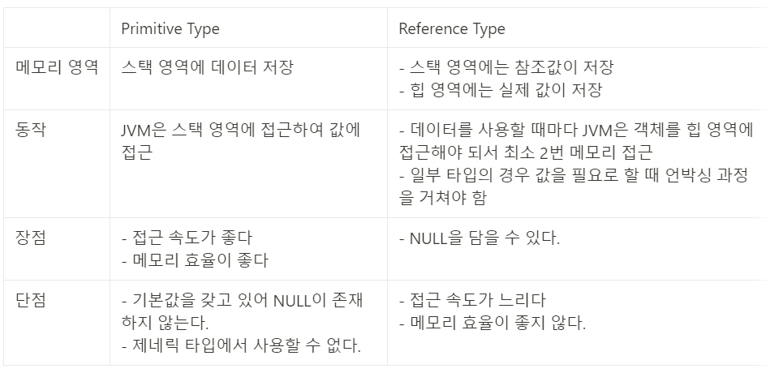
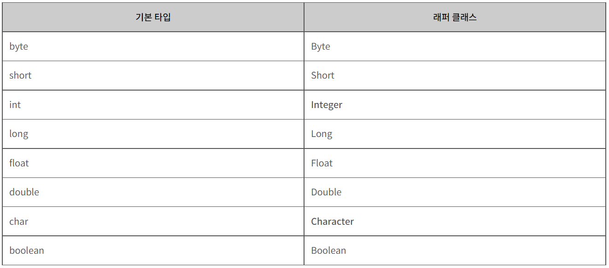
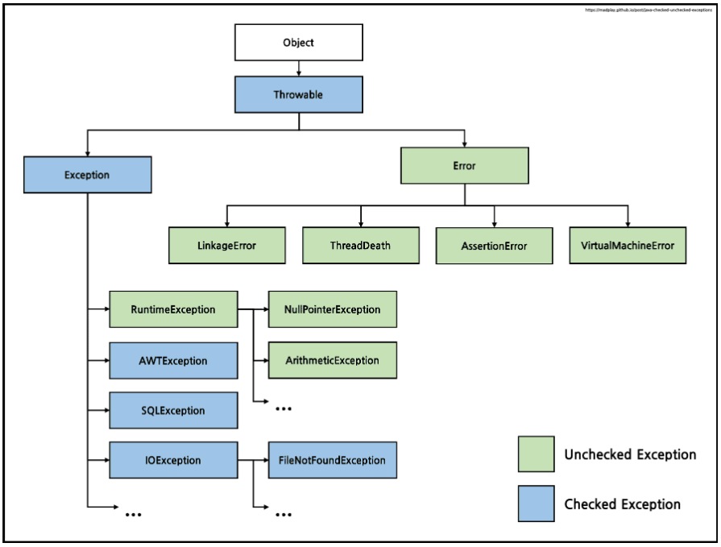

## 제어자

- 클래스, 변수, 메서드의 선언부에 사용돼 부가적인 의미를 부여
- 하나의 대상에 대해 여러 제어자를 조합해 사용하는 것이 가능하지만, 접근 제어자는 한번에 하나만 사용할 수 있다.

### 접근 제어자

- 목적
    - 클래스, 멤버변수, 메서드, 생성자에 사용돼 해당 클래스, 멤버변수, 메서드, 생성자를 외부에서 접근하지 못하도록 제한하는 역할
    - 클래스 내부에 선언된 데이터를 보호하기 위함 (캡슐화)
- 종류
    1. public : 접근 제한이 전혀 없음
    2. protected : 패키지에 관계없이 상속관계에 있는 자손 클래스에서 접근할 수 있고, 같은 패키지 내에서도 접근이 가능하다.
    3. default : 같은 패키지내의 클래스에서만 접근 가능
    4. private : 같은 클래스 내에서만 사용 가능

  | 제어자 | 같은 클래스 |  같은 패키지 | 자손 클래스 | 전체 |
  | --- | --- | --- | --- | --- |
  | public | O | O | O | O |
  | protected | O | O | O |  |
  | default | O | O |  |  |
  | private | O |  |  |  |

## 클래스, 객체, 인스턴스 차이

### 클래스

- 객체를 구현하기 위한 설계도
- 객체의 상태를 나타내는 필드와 객체의 행동을 나타내는 메서드와 객체를 초기화하여 생성하는 생성자로 구성된다.

### 객체

- 물리적으로 존재하거나 추상적으로 생각할 수 있는 것 중에서 자신의 속성을 가지고 있고 다른 것과 식별 가능한 것을 말한다. = 소프트웨어 세계에 구현할 대상
- 소프트웨어 세계에 구현할 대상으로, 클래스에 선언된 모양 그대로 생성된 실체

### 인스턴스

- 클래스에 따라 객체를 실체화한 것으로 실제로 메모리에 할당된 실체
- 객체를 소프트웨어에 실체화 하면 그것을 '인스턴스'라고 부른다.

## Overloading vs Overriding

### 오버로딩

- 같은 이름을 가진 메서드가 있어도 매개변수의 개수나 타입이 다르면 같은 이름을 사용해 메서드를 정의하는 것(다형성)
- 특징
    - 메서드 이름이 같아야 한다
    - 매개변수의 개수나 타입이 달라야한다.
    - 오버로딩은 매개변수에 의해서만 구별될 수 있으므로 반환타입은 오버로딩을 구현하는데 영향을 주지 못한다.
- 장점
    - 메서드의 이름을 짓는데 들이는 시간을 줄일 수 있다.
    - 메서드 이름을 일일이 구분해서 기억하지 않아도 된다.
    - 메서드 이름을 절약할 수 있다.

### 오버라이딩

- 조상 클래스로부터 상속받은 메서드의 내용을 자손 클래스에 맞게 변경하는 것(다형성)
- 특징
    - 메서드의 선언부는 조상 클래스와 일치해야한다 (메서드 이름, 매개변수, 반환타입)
    - 접근 제어자는 조상 클래스의 메서드보다 좁은 범위로 변경할 수 없다.
    - 예외는 조상 클래스의 메서드보다 많은 수의 예외를 선언할 수 없다.
    - 인스턴스 메서드 ↔ static 메서드 로 변경할 수 없다.

## Call by Reference 🆚 Call by Value

### 함수 호출

- 함수가 호출될 때 메모리 공간 안에서는 함수를 위한 별도의 임시 공간이 생성되고, 함수가 종료되면 해당 공간은 사라진다.
- 스택 프레임(Stack Frame) : 함수 호출시 할당되는 메모리 블록 (지역변수의 선언으로 인해 할당되는 메모리 블록)

### Call by Value

- 함수에서 값을 복사해 전달하는 방식으로, 인자로 전달되는 변수를 함수의 매개변수에 복사한다.
- 함수의 매개변수는 인자로 전달한 변수와는 별개의 변수가 되며 매개변수를 변경해도 원래의 변수에는 영향을 미치지 않는다.
    - 복사된 인자는 함수 안에서 지역적으로 사용되는 local value의 특성을 가진다.

### Call by Reference

- 함수에서 주소값을 전달하는 방식으로, 함수 호출시 인자로 전달되는 변수의 레퍼런스를 전달한다. (해당 변수를 가르킨다.)
- 함수 안에서 인자의 값이 변경되면, 인자로 전달된 객체의 값도 함께 변경된다.

### **자바에서의 Call by Value 🆚 Call by Reference**

- 함수에 전달되는 데이터 타입에 따라 함수 호출 방식이 달라진다
- 원시 자료형 (primitive type) : call-by-value 로 동작 (int, short, long, float, double, char, boolean )
- 참조 자료형 (reference type): call-by-reference 로 동작 (Array, Class Instance)

> 👉 **자바에서 Primitive Type과 NonPrimitve Type을 구별해 사용하는 이유**
>
> - 효율성을 위해서
> - 성능과 메모리 관점에서는 Primitive type 선택
> - null을 다뤄야 하거나, 제네릭 타입에서 사용돼야 하면 Reference Type 선택
> 

## Wrapper Class

### 정의

- primitive type의 데이터를 객체로 표현해야하는 경우, primitive type의 데이터를 객체로 포장해주는 클래스 (ex : 메소드의 인수로 Generic type가 지정돼 객체 타입만이 요구될 때)



### 박싱 & 언박싱

- Wrapper class는 산술 연산을 위해 정의된 클래스가 아니므로, 인스턴스에 저장된 값을 변경할 수 없다.
    - 단지, 값을 참조하기 위해 새로운 인스턴스를 생성하고, 생성된 인스턴스의 값만을 참조할 수 있다.
- Boxing : 기본 타입의 데이터를 래퍼 클래스의 인스턴스로 변환하는 과정
    - 형변환 메서드 : valueOf()
- UnBoxing : 래퍼 클래스의 인스턴스에 저장된 값을 다시 기본 타입의 데이터로 꺼내는 과정
    - 형변환 메서드 : parse()

> 👉 **오토박싱 & 오토언박싱**
>
> - JDK 1.5부터는 박싱과 언박싱이 필요한 상황에서 자바 컴파일러가 자동으로 처리한다.
> - 오토박싱 : new 키워드를 사용하지 않고도 자동으로 Character 인스턴스를 생성할 수 있다
>
> ```java
> Integer num = new Integer(17); // 박싱
> int n = num.intValue();        // 언박싱 
> 
> Character ch = 'X'; // Character ch = new Character('X'); : 오토박싱
> char c = ch;        // char c = ch.charValue();           : 오토언박싱
> ```
>

## 예외처리

### 예외 🆚 에러



- 예외 : 정상적 프로그램 흐름을 어긋나는 것으로, 직접 수습하여 처리할 수 있는 오류
- 에러 : 시스템에 비정상적인 상황이 발생한 오류로, 개발자가 미리 예측할 수도 없고 처리할 수 있는 방법도 없는 오류
    - ex) `OutOfMemoryError`, `ThreadDeath`, `StackOverflowError` 등

### 예외의 종류

1. Checked Exception
    - RuntimeException의 하위 클래스가 아니면서 Exception 클래스의 하위 클래스들
    - 반드시 에러 처리를 해야한다. (try/catch or throw)
    - 예외 발생 시 트랜잭션 처리 : Rollback이 되지 않고 트랜잭션이 commit까지 완료.
    - ex) `FileNotFoundException`, `ClassNotFoundException`
2. Unchecked Exception
    - RuntimeException의 하위 클래스들 / 실행 중에 발생할 수 있는 예외
    - 컴파일러가 에러처리를 확인하지 않는 RuntimeException 클래스들
    - 예외 발생 시 트랜잭션 처리 : Rollback이 된다.
    - ex) `ArrayIndexOutOfBoundsException`, `NullPointerException`

> 👉 ****Checked Exception은 Rollback되지 않는 이유****
>
> - Checked Exception는 복구가 가능하다는 메커니즘을 가지고 있다고 가정하기 때문.
> - 하지만 일반적으로 Checked Exception 예외가 발생했을 경우 복구 전략을 갖고 그것을 복구할 수 있는 경우는 그렇게 많지 않다.
    >     - Checked Exception을 만나면 더 구체적인 Unchecked Exception을 발생시켜 정확한 정보를 전달하고 로직의 흐름을 끊어야 하는 것이 더 좋음.
>     - JPA에 구현체를 가져다 사용하더라도 Checked Exception을 직접 처리하지 않고 있는 이유도 다 적절한 RuntimeException으로 예외를 던져주고 있기 때문

### 예외 처리 종류

1. 예외 복구 : 예외 상황을 파악하고 문제를 해결해 정상 상태로 돌려놓는 방법
2. 예외처리 회피 : 예외 처리를 직접 담당하지 않고 호출한 쪽으로 던져 회피하는 방법
3. 예외 전환
    - 예외 회피와 비슷하게 메서드 밖으로 예외를 던지지만, 그냥 던지지 않고 적절한 예외로 전환해서 넘기는 방법
    - 조금 더 명확한 의미로 전달되기 위해 적합한 의미를 가진 예외로 변경

---

> 🔗 **참고**
>
> - [https://mong9data.tistory.com/123](https://mong9data.tistory.com/123)
> - [https://edu.goorm.io/learn/lecture/201/한-눈에-끝내는-c언어-기초/lesson/1271949/call-by-value-call-by-reference](https://edu.goorm.io/learn/lecture/201/%ED%95%9C-%EB%88%88%EC%97%90-%EB%81%9D%EB%82%B4%EB%8A%94-c%EC%96%B8%EC%96%B4-%EA%B8%B0%EC%B4%88/lesson/1271949/call-by-value-call-by-reference)
> - [https://88240.tistory.com/448](https://88240.tistory.com/448)
> - [https://gona.tistory.com/57](https://gona.tistory.com/57)
> - [http://www.tcpschool.com/java/java_api_wrapper](http://www.tcpschool.com/java/java_api_wrapper)
> - [https://woovictory.github.io/2019/02/07/Java-Why-is-needed-primitive-type/](https://woovictory.github.io/2019/02/07/Java-Why-is-needed-primitive-type/)
> - [https://joebaak.blogspot.com/2017/05/primitive-type-reference-type.html](https://joebaak.blogspot.com/2017/05/primitive-type-reference-type.html)
> - [https://siyoon210.tistory.com/139](https://siyoon210.tistory.com/139)
> - [https://steady-coding.tistory.com/606](https://steady-coding.tistory.com/606)
> - [https://coding-factory.tistory.com/547](https://coding-factory.tistory.com/547)
> - [https://madplay.github.io/post/java-checked-unchecked-exceptions](https://madplay.github.io/post/java-checked-unchecked-exceptions)
> - [https://devlog-wjdrbs96.tistory.com/351](https://devlog-wjdrbs96.tistory.com/351)
> - [https://cheese10yun.github.io/checked-exception/](https://cheese10yun.github.io/checked-exception/)
