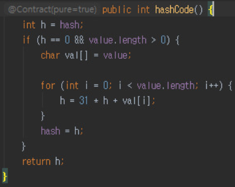
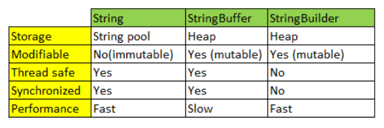

## **java.lang.Object 클래스**

- Object 클래스는 모든 자바 클래스의 최고 조상 클래스이다.
    - 필드를 가지지 않으며, 총 11개의 메소드만으로 구성돼있다.
    - 자바의 모든 클래스는 Object 클래스의 모든 메소드를 바로 사용할 수 있다.

> 👉**Object와 Generic 차이**
>
> - 제네릭은 데이터의 타입을 일반화하여 클래스나 메소드에서 사용할 데이터의 타입을 컴파일 시에 지정하는 것
> - 오브젝트는 모든 클래스의 조상 클래스
> - 클래스와 메소드가 여러 타입의 데이터를 다룰 때 ‘Object 타입을 사용’하거나, ‘제네릭을 사용’하거나, ‘동일한 메커니즘을 가진 클래스와 메소드를 여러 개 정의’할 수 있다.
> - **Object**를 사용하면 **‘동일한 메커니즘의 여러 클래스나 메서드를 정의하는 것’**보다 코드 중복이 덜 하지만, 객체의 타입을 컴파일 타임에 확인할 수 없어 런타임에 형변환하면서 오류가 발생할 수 있다.
> - 하지만 **제네릭**을 사용하면 객체의 타입을 컴파일 타임에 체크할 수 있어 타입 안정성을 높이고 형변환을 하지 않아도 된다.

## equals() & hashcode()

### **equals() 메소드**

- 매개타입 : Object로 모든 객체가 매개 값으로 대입될 수 있다.
    - 모든 객체는 Object 타입으로 자동 타입 변환될 수 있기 때문
- 2개의 객체가 동일한지 검사하기 위해 사용
  (2개의 객체가 가리키는 곳이 동일한 메모리 주소일 경우에만 동일한 객체)
- **문자열 equals()**
    - 문자열을 2개 생성하면 2개의 문자열은 서로 다른 메모리 상에 할당된다.
    - 하지만 equals를 사용하면 true인 이유는 String 클래스에서 equals 메소드를 오버라이드하여 문자를 비교하는 코드를 추가했기 때문이다.

> 👉**equals 오버라이딩 방법**
>
> 1. 매개값(비교객체; Object로 모든 객체를 받는다)이 기준 객체와 동일한 타입의 객체인지 먼저 확인(instanceof 연산자)
> 2. 다른 타입이면 return false, 같은 타입이면 기준 객체 타입으로 강제 타입 변환하여 비교하고자 하는 필드 값이 동일한지 검사

### hashcode()

- `public native int hashCode();`

> 👉**native 키워드**
>
> - 메소드가 JNI(Java Native Interface)라는 native code를 이용해 구현되었다.
> - native는 메소드에만 적용가능한 제어자로, C or C++ 등 Java가 아닌 언어로 구현된 부분을 JNI를 통해 Java에서 이용하고자 할 때 사용된다.
- 실행 중에(Runtime) 객체의 유일한 integer값을 반환한다.
    - Object의 hashCode() 메소드는 **객체의 메모리 주소**를 이용해서 해시코드를 만들어 리턴하기 때문에 객체마다 다른 값을 가지고 있다.
- HashTable과 같은 자료구조를 사용할 때 데이터가 저장되는 위치를 결정하기 위해 사용
- **문자열 hashCode()**

  

    - 문자열에서 한 글자씩 가져와 정수값으로 변경한다.
    - 한글자를 가져와 정수와 더하면서 해당 글자의 ascii 코드 값을 사용
    - 주소값을 기준으로 정수값의 hashCode를 생성하는 것이 아니기 때문에
      **서로 다른 String 객체도 문자열이 같으면 hashCode가 같다**
    - [다른 문자열, 같은 hashCode](https://blog.ggaman.com/916)

  > 👉**31을 곱하는 이유**
  >
  > - 짝수를 곱하면 오버플로우 됐을 때 정보 손실발생 가능하기 때문에 홀수사용
      > (이진수에서 2를 곱하면 비트가 왼쪽으로 한 비트씩 이동)
  > - `31*i = (i<<5) - i` 이기 때문에 곱셈 대신 비트 이동 및 뺄셈으로 처리해 성능면에서 효율적이다. (요즘 VM은 자동으로 최적화)

### **equals와 hashCode의 관계**

- Java 프로그램을 실행하는 동안 equals에 사용된 정보가 수정되지 않았다면, hashCode는 항상 동일한 정수값을 반환해야 한다. (Java의 프로그램을 실행할 때 마다 달라지는 것은 상관이 없다.)
- 동일한 객체는 동일한 메모리 주소를 갖는다는 것을 의미하므로, 동일한 객체는 동일한 해시코드를 가져야 한다.
    - `o1.equals(o2) = true` → `o1.hashCode() = o2.hashCode()` 의 논리
- ****equals()와 hashcode()를 같이 재정의해야 하는 이유****
    - equals() 메소드를 오버라이드 한다면, hashCode() 메소드도 오버라이드 되어야 한다.
    - 다른 객체에 대해 동일한 hashCode를 생성한다면 hashCode를 사용하는 자료구조를 생성하는데 불이익이 있다.

> **👉 ORM 사용 시 equals(), hashCode() 오버라이드**
>
> - hashCode와 equals를 오버라이드 하는 메소드 내부에서 Getter 사용 권장한다.
> - ORM에 의해 필드가 Lazy Loaded돼, getter를 부르기 전엔 사용 불가능할 수 있기 때문이다.

## String

### String

> 👉**String 생성방법**
>
> - `String a = new String("");`
>     - String 인스턴스 생성 후 heap에서 관리
> - `String a = "";`
>     - String 인스턴스 생성 후 heap의 String constant pool에서 관리
>     - 값이 같다면 하나의 객체를 참조한다.
- String 인스턴스는 한 번 생성되면 그 값을 읽기만 할 수 있고, 변경할 수는 없다.
  (불변 객체(immutable object))
- 자바에서 덧셈(+) 연산자를 이용하여 문자열 결합을 수행하면, 기존 문자열의 내용이 변경되는 것이 아니라 내용이 합쳐진 새로운 String 인스턴스가 생성되는 것
    - 새로운 인스턴스가 생성되면서 이전의 인스턴스는 GC에 의해 사라짐
- **변하지 않는 문자열**을 자주 읽어들이는 경우 **String을 사용**하면 성능이 좋다.
    - 문자열 추가, 수정, 삭제 등의 연산이 많을 때 String 클래스를 사용하면 힙 메모리에 많은 Garbage가 생성되어 힙메모리가 부족해지며 어플리케이션 성능에 부정적인 영향이 있다.

  ⇒ **가변(mutable)성**을 가지는 **StringBuffer**/**StringBuilder** 클래스를 도입

### StringBuffer vs StringBuilder

- 동기화 유무의 차이
    - StringBuffer : 동기화 키워드를 지원해 멀티쓰레드 환경에서 안전하다(thread safe)
    - StringBuilder : 동기화를 지원하지 않아 멀티쓰레드 환경에서 안전하지 않지만, 단일쓰레드에서는 성능이 StringBuffer보다 뛰어나다.
    - cf ) String = 불변이므로 멀티쓰레드 환경에서 안전하다(thread safe)

## List

### ArrayList

- ArrayList는 내부적으로 데이터를 배열에서 관리하며 데이터의 추가, 삭제를 위해 임시 배열을 생성해 데이터를 복사하는 방법을 사용한다.
- **삽입/삭제**
    - 기본적으로 배열을 사용하지만 크기를 지정하지 않고 동적으로 값을 삽입/삭제할 수 있다.
    - 데이터의 삽입과 삭제시 ArrayList는 그만큼 위치를 맞춰주어야 하기 때문에 삽입과 삭제가 많다면 비효율적이다.
- **조회**
    - 인덱스가 있어 조회 속도가 빠르기 때문에 정적인 데이터를 활용하면서 조회가 빈번하다면 ArrayList를 사용

### LinkedList

- 데이터를 저장하는 각 노드마다 앞,뒤 원소의 위치값을 가지고 있다
- 내부적으로 양방향의 연결 리스트로 구성되어 있어 참조하려는 원소에 따라 처음부터 정방향 또는 역순으로 순회 가능
  (배열의 단점을 보완하기 위해 LinkedList가 고안되었다.)
- **삽입삭제**
    - 데이터를 삽입/삭제시 가리키고 있는 주소값만 변경해주면 되기 때문에 ArrayList에 비해 효율적이다.
    - 동적으로 삽입/삭제가 빈번하다면 LinkedList를 사용
- **조회**
    - 순차적 접근이기 때문에 검색의 속도가 느리다.

## Map

### HashTable

- 키의 순서는 무작위이다.
- 해시충돌 해결로는 연결리스트로 이뤄진 배열로 구현돼있다.
- 검색/삽입 =  O(1)

### HashMap

- 키의 순서는 무작위이다.
- 연결리스트로 이뤄진 배열로 구현돼있다.
- null key, null value 허용
- 검색/삽입 =  O(1)

> **👉 HashMap 🆚 HashTable**
>
> - 공통점
>     - 검색/삽입 = O(N)
>     - 키의 순서는 무작위
>     - 연결리스트로 이뤄진 배열로 구성
> - 차이점
>
>   |  | HashMap | HashTable |
>   |---|---|---|
>   | null key, null value | 허용 | 불허용 |
>   | 동기화(멀티쓰레드) | 미지원 | 지원 |
>   | 속도 | 상대적으로 빠름 | 상대적으로 느림 |

### LinkedHashMap

- 키의 순서가 삽입한 순서대로 정렬돼있다.
- **양방향 연결 버킷**으로 구현돼있다.
- 검색/삽입/삭제 = O(1)

### TreeMap

- 키의 순서가 정렬돼있다. (key가 반드시 Comparable 인터페이스를 구현해야함)
- 버킷이 레드-블랙 트리로 구현돼있다.
- 검색/삽입 = O(logN)

> **👉 HashMap vs ConcurrentHashMap**
>
> - **`Hashtable`**
    >     - 메소드 전체에 synchronized 키워드가 존재해 메소드 전체가 임계구역으로 설정된다
>     - 동시에 작업을 하려해도 객체마다 Lock을 하나씩 가지고 있기 때문에 동시에 여러 작업을 해야할 때 병목현상이 발생할 수 있다.
        >     (메소드에 접근하게 되면 다른 쓰레드는 Lock을 얻을 때까지 기다려야 하기 때문)
>     - Thread-safe 하다는 특징이 있긴 하지만, 멀티쓰레드 환경에서 사용하기에도 살짝 느리다.
>     - Collection Framework가 나오기 이전부터 존재하는 클래스이기 때문에 최근에는 잘 사용하지 않는 클래스.
> - **`HashMap`**
    >     - 동기화를 지원하지 않아 Map 인터페이스를 구현한 클래스 중에서 성능이 제일 좋다.
>     - Multi-Thread 환경에서 사용할 수 없다
> - **`ConcurrentHashMap`**
    >     - Hashtable 클래스의 단점 보완 + 멀티쓰레드 환경에서 사용할 수 있도록 나온 클래스이다.(JDK 1.5에 검색과 업데이트시 동시성 성능을 높이기 위해서 나온 클래스)
>     - 읽기 작업에는 여러 쓰레드가 동시에 읽을 수 있지만, 쓰기 작업에는 특정 세그먼트 or 버킷에 대한 Lock을 사용한다.
>     - 여러 쓰레드에서 ConcurrentHashMap 객체에 동시에 데이터를 삽입, 참조하더라도 그 데이터가 다른 세그먼트에 위치하면 서로 락을 얻기 위해 경쟁하지 않는다.
> - HashMap, Hashtable, ConcurrentHashMap 클래스 모두 Map의 기능적으로는 큰 차이가 없다.

---

> 🔗**참고**
>
> - [http://www.tcpschool.com/](http://www.tcpschool.com/java/java_api_object)
> - [https://jisooo.tistory.com/entry/java-hashcode와-equals-메서드는-언제-사용하고-왜-사용할까](https://jisooo.tistory.com/entry/java-hashcode%EC%99%80-equals-%EB%A9%94%EC%84%9C%EB%93%9C%EB%8A%94-%EC%96%B8%EC%A0%9C-%EC%82%AC%EC%9A%A9%ED%95%98%EA%B3%A0-%EC%99%9C-%EC%82%AC%EC%9A%A9%ED%95%A0%EA%B9%8C)
> - [https://mangkyu.tistory.com/101](https://mangkyu.tistory.com/101)
> - [http://www.tcpschool.com/java/java_api_object](http://www.tcpschool.com/java/java_api_object)
> - [https://kephilab.tistory.com/92](https://kephilab.tistory.com/92)
> - [https://brunch.co.kr/@mystoryg/133](https://brunch.co.kr/@mystoryg/133)
> - [https://ict-nroo.tistory.com/18](https://ict-nroo.tistory.com/18)
> - [https://ifuwanna.tistory.com/221](https://ifuwanna.tistory.com/221)
> - [https://offbyone.tistory.com/401](https://offbyone.tistory.com/401)
> - [https://brunch.co.kr/@mystoryg/39](https://brunch.co.kr/@mystoryg/39)
> - [https://dev-coco.tistory.com/19](https://dev-coco.tistory.com/19)
> - [https://devlog-wjdrbs96.tistory.com/269](https://devlog-wjdrbs96.tistory.com/269)
> - [https://velog.io/@cyranocoding/Hash-Hashing-Hash-Table해시-해싱-해시테이블-자료구조의-이해-6ijyonph6o](https://velog.io/@cyranocoding/Hash-Hashing-Hash-Table%ED%95%B4%EC%8B%9C-%ED%95%B4%EC%8B%B1-%ED%95%B4%EC%8B%9C%ED%85%8C%EC%9D%B4%EB%B8%94-%EC%9E%90%EB%A3%8C%EA%B5%AC%EC%A1%B0%EC%9D%98-%EC%9D%B4%ED%95%B4-6ijyonph6o)
> - [https://d2.naver.com/helloworld/831311](https://d2.naver.com/helloworld/831311)