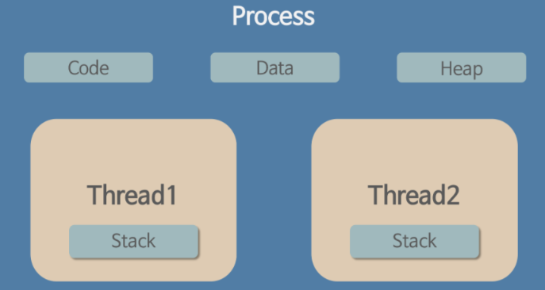

## 운영체제 소개

### 운영체제 정의

- 컴퓨터 HW 바로 위에 설치돼 사용자 및 다른 모든 SW와 HW를 연결하는 SW계층

### 운영체제 필요성

> **👉운영체제 역사**
>
> [https://inuplace.tistory.com/279](https://yunzuo.tistory.com/2)
> [https://yunzuo.tistory.com/2](https://yunzuo.tistory.com/2)
>
- 운영체제는 사용자 관점의 **편의성**, 자원 할당자로서 자원 활용의 **효율성** 마지막으로 다양한 입출력 장치의 운영 및 제어의 **일관성**을 추구해야한다.

### 운영체제 역할

- **자원관리(효율성, 형평성)**
    - 컴퓨터 자원을 응용한 프로그램에 할당하여 사용자가 원활하게 작업할 수 있도록 돕는다.
    - 순서를 통해 자원을 할당하고 적절한 시점에 다시 자원을 회수하여 다른 응용 프로그램에 할당한다.
- **자원보호(안정성)**
    - 악의적인 사용자나 미숙한 사용자의 비정상적인 작업으로터 컴퓨터 자원을 지키는 것도 운영체제의 역할 중 하나이다.
- **하드웨어 인터페이스 제공(확장성)**
    - 복잡한 과정없이 다양한 장치를 사용할 수 있도록 해주는 하드웨어 인터페이스를 제공한다.
    - 이는 드라이버를 컴퓨터에 설치해야 가능하다
    - 드라이버는 하드웨어 장치와 상호작용하기 위해 만들어진 컴퓨터 프로그램이며 운영체제를 설치할 때 자동으로 설치되지만 일부는 따로 설치해야한다.
- **사용자 인터페이스 제공(편리성)**
    - 사용자가 운영체제를 편리하게 사용하도록 지원하기 위한 것이다.
    - 과거 키보드만 사용하는 인터페이스부터 GUI(Graphical User Interface)를 제공하여 대부분의 작업을 마우스로 사용하거나 터치스크린을 활용하는 스마트폰의 인터페이스 등 운영체제를 편리하게 사용할 수 있도록 제공되는 기능이 사용자 인터페이스이다.

## 운영체제 구조

### 커널

- 프로세스 관리, 메모리 관리, 저장장치 관리와 같은 운영체제의 핵심적인 기능을 모아놓은 것.

> **👉커널의 구조**
>
> 1. **단일형 구조 커널**
>
>     
>
>     - 초창기의 운영체제 구조로, 커널의 핵심 기능을 구현하는 모듈들이 구분 없이 하나로 구성되어 있다.
>     - 장점
>         - 모듈이 거의 분리되지 않아 모듈 간의 통신 비용이 줄어들어 효율적인 운영 가능
>     - 단점
>         - 모든 모듈이 하나로 묶여 있기 때문에 버그나 오류 처리하기 어렵다
>         - 운영체제의 여러 기능이 서로 연결되어 있어 상호 의존성이 높기 떄문에 기능상 작은 결함이 시스템 전체 성능 문제 야기
>         - 다양한 환경 시스템에 적용이 어렵다. (수정이 불가능 하기 때문에)
> 2. **계층형 구조 커널**
>
>     
>
>     - 계층형 구조커널은 단일형 구조 커널이 발전된 형태로, 비슷한 기능을 가진 모듈을 묶어서 하나의 계층으로 만들고 계층 간의 통신을 통해 운영체제를 구현하는 방식
>     - 비슷한 기능을 모다 모듈화했기 떄문에 단일형 구조보다 버그나 오류 쉽게 수정
>     - 오류 발생 시 해당 계층만 고치면 되기 때문에 디버깅도 수월

### 인터페이스

- 커널에 사용자의 명령을 전달하고 실행 결과를 사용자에게 알려주거나 응용프로그램에 반환하는 역할

### 드라이버

- 커널과 하드웨어의 인터페이스를 담당한다.
- 커널이 제공하는 드라이버도 있고 하드웨어 제작자가 제공하는 드라이버도 있어 하드웨어와 커널이 직접 연결되도록 하고 드라이버를 통해 제동되기도 한다.
- 응용 프로그램과 커널의 인터페이스가 시스템 호출이라면 커널과 하드웨어의 인터페이스는 드라이버가 담당한다.
- 하드웨어의 종류는 다양하고 직접 각 하드웨어에 맞는 인터페이스를 개발하기는 어렵기 때문에 커널은 입출력의 기본적인 부분만 제작하고, 하드웨어의 특성을 반영한 소프트웨어를 하드웨어 제작자에게 받아 커널이 실행될 때 함께 실행되도록 한다.
    - 이 때 하드웨어 제작자가 만든 소프트웨어를 디바이스 드라이버라고 부른다.
- [그림]에서 보면 시스템 호출은 커널 전체 영역을 감싸고 있는데, 이는 시스템 호출을 거치지 않고서는 커널에 진입할 수 없다는 의미입니다.
- 하지만 드라이버는 일부 영역으로 표시되고 있는데, 이는 커널이 제공하는 드라이버( 키보드 , 마우스 ..)도 있고 하드웨어 제작자가 제공하는 드라이버도 있다는 뜻입니다.

### 미들웨어

- 응용 소프트웨어가 운영체제로부터 제공받는 서비스 외에 추가적으로 이용할 수 있는 서비스를 제공하는 컴퓨터 소프트웨어

### 시스템 호출

- 커널이 자신을 보호하기 위해 만든 인터페이스
- 사용자 프로그램이 스스로 인터럽트를 걸어 os로 cpu 권한을 넘기는 것
- 커널은 사용자나 응용 프로그램으로부터 컴퓨터 자원을 보호하기 위해 자원에 직접 접근하는 것을 차단한다.
- 따라서 자원을 이용하기 위해서는 시스템 호출이라는 인터페이스를 사용하여 접근하여야 한다.

ex) printf 함수는 사용자가 시스템의 특정 위치에 문자를 출력할 수 있게 하는 시스템 호출이다.

- 특징
    - 시스템 호출은 커널이 제공하는 시스템 자원의 사용과 연관된 함수이다.
    - 응용 프로그램이 하드웨어 자원에 접근하거나 운영체제가 제공하는 서비스를 이용하려 할 때는 시스템 호출을 사용해야 한다.
    - 운영체제는 커널이 제공하는 서비스를 시스템 호출로 제한하고 다른 방법으로 커널에 들어오지 못하게 막음으로써 컴퓨터 자원을 보호한다.
    - 시스템 호출은 커널이 제공하는 서비스를 이용하기 위한 인터페이스이며, 사용자가 자발적으로 커널 영역에 진입할 수 있는 유일한 수단이다.

> 👉**Application이 여러 운영체제에서 실행될 수 있게 만드는 방법 3가지**
>
> 1. 운영체제마다 인터프리터가 제공되는 인터프리터 언어로 Application을 만드는 방법 (ex. Python, Ruby)
> 2. 실행 중인 Application을 포함하고 있는 가상 머신을 가진 언어로 Application을 만드는 방법 (ex. JAVA)
> 3. 컴파일러가 기기 및 운영체제 고유의 이진 파일을 생성하는 표준 언어 또는 API를 사용하는 방법 (ex. POSIX API)

## 프로세스

### 프로세스 개념

- 일반적으로 실행중인 프로그램을 말한다

### 프로세스 상태

1. NEW : 프로세스가 생성됨
2. RUNNING : 프로세스가 실행됨, CPU에 명령어를 로드해서 실행하는 상태.
3. BLOCKED(ex. wait, sleep) : 프로세스가 자신이 요청한 이벤트를 기다리는 상태로 지금 당장 cpu를 주어도 수행할 수 없는 상태
4. READY : 모든 조건이 만족되고 cpu를 기다리는 상태
5. TERMINATED : 프로세스 실행이 끝낸 상태

### 프로세스 주소공간

1. Code : 소스코드 부분, 기계어 코드가 지정, 컴파일 시 결정되고 중간에 코드를 바꾸지 못하게 read-only로 설정
2. Data : 전역변수, 정적변수, 배열이 저장되는 영역(프로그램 구동 시 항상 접근 가능한 변수) / 프로그램 실행과 함께 할당되고 종료되면 소멸한다.
3. Stack : 지역변수, 매개변수가 저장되는 영역/원시타입의 데이터가 할당/함수 호출과 함께 할당되고 함수 호출이 완료되면 소멸/stack over flow 에러 발생 가능
4. Heap : 참조형 데이터 값이 저장/런타임에 크기가 결정되는 메모리 영역/사용자에 의해 메모리 공간이 동적으로 할당되고 해제

### 프로세스 제어 블록

- 운영체제가 각 프로세스를 관리하기 위해 프로세스 당 유지하는 정보
- 프로세스 스케줄링을 위해 프로세스에 관한 모든 정보를 가지고 있는 데이터베이스를 PCB
- 프로세스는 CPU가 처리하던 작업의 내용들을 자신의 PCB에 저장하고, 다음에 다시 CPU를 점유하여 작업을 수행해야 할 때 PCB로부터 해당 정보들을 CPU에 넘겨와서 계속해서 하던 작업을 진행할 수 있게 됩니다.
- 구성요소
    1. os가 관리상 사용하는 정보 : 프로세스 상태, 프로세스 id, cpu 스케쥴링 정보, 우선순위
    2. cpu 수행관련 hw값 : program counter(해당 프로세스가 실행할 명령어 주소, 수행 위치), 레지스터
    3. 메모리 관련 : code, data, stack의 위치정보
    4. 파일관련

### 프로세스 문맥 교환

- 사용자 프로세스 간 교환
- time interrupt나 I/O요청이 들어오면 cpu를 한 프로세스에서 다른 프로세스로 넘겨주는 과정
    1. cpu를 내어주는 프로세스의 상태를 해당 프로세스의 pcb에 저장
    2. cpu를 얻는 프로세스의 상태를 pcb에서 읽어옴

> **👉커널 주소공간**
>
> - 운영체제도 하나의 프로세스이므로 커널 역시 주소 공간인 code, data, stack 영역을 갖는다.
> 1. **code 영역**
>     - 시스템 콜, 인터럽트 처리 코드
>     - CPU, 메모리 등 자원 관리를 위한 코드
>     - 편리한 인터페이스 제공을 위한 코드
> 2. **data 영역**
>     - PCB(Process Controll Block) : 현재 수행 중인 프로세스의 상태, CPU 사용 정보 등을 유지하기 위한 자료구조
>     - CPU, Memory 등 하드웨어 자원을 관리하기 위한 자료구조가 저장
> 3. **stack 영역**
>     - 각 Process의 커널 스택을 저장
>         - 프로세스는 함수 호출시 자신의 복귀 주소를 저장하지만, 커널은 커널 내의 주소가 된다.
>     - 각각의 프로세스마다 별도의 스택을 두어 관리한다.

## 스레드

### 스레드 개념

- 프로세스 내에서 실제로 작업을 수행하는 단위

### 멀티스레드의 구조

- 프로세스 내에서 stack만 따로 할당받고, code, data, heap 영역은 공유한다.

### 멀티 프로세스 VS 멀티 스레드

1. 멀티 프로세스
    - 하나의 응용프로그램을 여러 개의 프로세스로 구성해 각 프로세스가 하나의 task를 처리하는 것
    - 장점 : 서로 다른 프로세스에 영향을 미치지 않아 하나가 죽어도 정상적으로 수행된다.
    - 단점
        - 많은 메모리와 cpu 시간을 차지한다.
        - 문맥교환의 오버헤드가 생긴다.
        - 프로세스 간 통신하려면 복잡한 과정(Inter Process Communication)을 거쳐야 한다.
2. 멀티 쓰레드
    - 단일 프로세스의 컨텍스트 내에서 여러 스레드를 동시에 실행하는 것
    - 장점
        - 적은 메모리를 사용하고, 문맥교환이 빠르다.
        - 쓰레드 간 통신에 별도의 자원을 이용하지 않아도 되고 data, heap 영역을 통해 데이터를 공유하여 사용한다.
    - 단점
        - 자원을 공유하기 때문에 하나의 스레드만 죽어도 전체 스레드가 종료될 수 있다.
        - 동기화 문제(동일한 자원에 동시에 접근해 작업을 실행하면서 자원이 동일성을 가지지 못하는 문제)를 가질 수 있다

> **👉멀티쓰레드 동기화 문제 해결**
>
> - 운영체제도 하나의 프로세스이므로 커널 역시 주소 공간인 code, data, stack 영역을 갖는다.
> 1. **code 영역**
>     - 시스템 콜, 인터럽트 처리 코드
>     - CPU, 메모리 등 자원 관리를 위한 코드
>     - 편리한 인터페이스 제공을 위한 코드
> 2. **data 영역**
>     - PCB(Process Controll Block) : 현재 수행 중인 프로세스의 상태, CPU 사용 정보 등을 유지하기 위한 자료구조
>     - CPU, Memory 등 하드웨어 자원을 관리하기 위한 자료구조가 저장
> 3. **stack 영역**
>     - 각 Process의 커널 스택을 저장
>         - 프로세스는 함수 호출시 자신의 복귀 주소를 저장하지만, 커널은 커널 내의 주소가 된다.
>     - 각각의 프로세스마다 별도의 스택을 두어 관리한다.