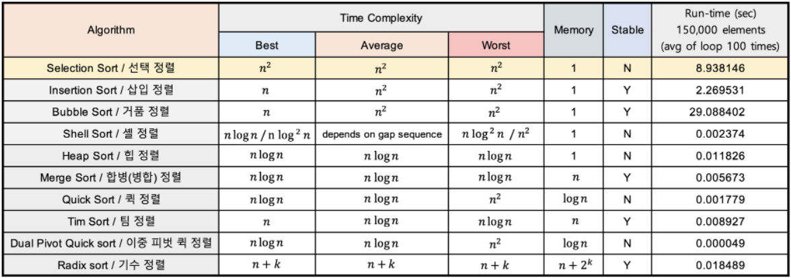

## 선택정렬

- `비교정렬` / `제자리정렬` / `불안정정렬`

### 정렬방법

- 현재 위치에 들어갈 데이터를 찾아 선택하는 알고리즘
    1. 주어진 리스트에서 최솟값을 찾는다.
    2. 최솟값을 맨 앞 자리의 값과 교환한다.
    3. 맨 앞 자리를 제외한 나머지 값들 중 최솟값을 찾아 위와 같은 방법으로 반복한다.

### 장점

- 추가적인 메모리 소비가 적다

### 단점

- 시간복잡도가 O(N²)
- 불안정정렬(정렬 규칙이 다수이거나 특정 순서를 유지해야 할 때 문제가 될 수 있다.)

## 버블정렬

- `비교정렬` / `제자리정렬` / `안정정렬`

### 정렬방법

- 두 개의 인접한 원소를 비교하여 정렬하는 방식
    1. 앞에서부터 현재 원소와 바로 다음의 원소를 비교한다.
    2. 현재 원소가 다음 원소보다 크면 원소를 교환한다.
    3. 다음 원소로 이동하여 해당 원소와 그 다음원소를 비교한다.
- 맨 뒤 index에 최대값이 위치하게 정렬반복

### 장점

- 추가적인 메모리 소비가 적다
- 구현이 쉽다
- 안정정렬

### 단점

- 시간복잡도가 O(N²)

> 👉**버블정렬, 최선의 경우에 시간복잡도 O(N)으로 만드는 방법**
>
> - 각 라운드에서 비교수행을 할 때 원소가 교환되지 않는다면, 즉 swap이 발생하지 않는다면 이는 이미 정렬된 데이터라는 의미이기 때문에 정렬을 종료한다.
>

## 삽입정렬

- `비교정렬` / `제자리정렬` / `안정정렬`

### 정렬방법

- 현재 비교하고자 하는 target(타겟)과 그 이전의 원소들과 비교하며 자리를 교환(swap)하는 정렬 방법
    1. 현재 타겟이 되는 숫자와 이전 위치에 있는 원소들을 비교한다.
       (첫 번째 타겟은 두 번째 원소부터 시작한다.)
    2. 타겟이 되는 숫자가 이전 위치에 있던 원소보다 작다면 위치를 서로 교환한다.
    3. 그 다음 타겟을 찾아 위와 같은 방법으로 반복한다.

### 장점

- 추가적인 메모리 소비가 적다
- 거의 정렬 된 경우 매우 효율적이다. (최선의 경우 O(N))
- 안장정렬이 가능하다.

### 단점

- 역순에 가까울 수록 매우 비효율적이다. (최악의 경우 O(N²))
- 데이터의 상태에 따라서 성능 편차가 매우 크다.

---

## 병합 정렬

- `비교정렬` / `제자리정렬` / `안정정렬`
- 문제를 분할하고, 분할한 문제를 정복하여 합치는 과정(분할 정복' 알고리즘을 기반으로 정렬)
    1. 주어진 리스트를 절반으로 분할하여 부분리스트로 나눈다. (Divide : 분할)
    2. 해당 부분리스트의 길이가 1이 아니라면 1번 과정을 되풀이한다.
    3. 인접한 부분리스트끼리 정렬하여 합친다. (Conquer : 정복)

### 장점

- 항상 두 부분리스트로 쪼개어 들어가기 때문에 최악의 경우에도 **O(NlogN)** 으로 유지
- 안정정렬이다.

### 단점

- 정렬과정에서 추가적인 보조 배열 공간을 사용하기 때문에 메모리 사용량이 많다.
- 보조 배열에서 원본배열로 복사하는 과정은 매우 많은 시간을 소비하기 때문에
  데이터가 많을 경우 상대적으로 시간이 많이 소요된다.

## 퀵 정렬

- `비교정렬` / `제자리정렬` / `불안정정렬`

### 정렬방법

- 하나의 리스트를 피벗(pivot)을 기준으로 두 개의 부분리스트로 나누어
  하나는 피벗보다 작은 값들의 부분리스트, 다른 하나는 피벗보다 큰 값들의 부분리스트로 정렬한 다음, 각 부분리스트에 대해 다시 위 처럼 재귀적으로 수행하여 정렬하는 방법
    1. 피벗을 하나 선택한다.
    2. 피벗을 기준으로 양쪽에서 피벗보다 큰 값, 혹은 작은 값을 찾는다. 왼쪽에서부터는 피벗보다 큰 값을 찾고, 오른쪽에서부터는 피벗보다 작은 값을 찾는다.
    3. 양 방향에서 찾은 두 원소를 교환한다.
    4. 왼쪽에서 탐색하는 위치와 오른쪽에서 탐색하는 위치가 엇갈리지 않을 때 까지 2번으로 돌아가 위 과정을 반복한다.
    5. 엇갈린 기점을 기준으로 두 개의 부분리스트로 나누어 1번으로 돌아가 해당 부분리스트의 길이가 1이 아닐 때 까지 1번 과정을 반복한다. (Divide : 분할)
    6. 인접한 부분리스트끼리 합친다. (Conquer : 정복)

### **장점**

- 특정 상태가 아닌 이상 평균 시간 복잡도는 **NlogN**이며, 다른 NlogN 알고리즘에 비해 대체적으로 속도가 매우 빠르다.
- 유사하게 NlogN 정렬 알고리즘 중 분할정복 방식인 merge sort에 비해 2~3배정도 빠르다. (정리 부분의 표 참고)
- 추가적인 별도의 메모리를 필요로하지 않으며 재귀 호출 스택프레임에 의한 공간복잡도는 logN으로 메모리를 적게 소비한다.

### **단점**

- 특정 조건하(바로 정렬 된 상태의 배열을 정렬하고자 할 때)에 성능이 급격하게 떨어진다.
  (최악의 경우 O(N²))
- 재귀를 사용하기 때문에 재귀를 사용하지 못하는 환경일 경우 그 구현이 매우 복잡해진다.

## 힙 정렬

### **장점**

- 최악의 경우에도 **O(NlogN)** 으로 유지가 된다.
- 힙의 특징상 부분 정렬을 할 때 효과가 좋다.

### **단점**

- 일반적인 **O(NlogN)** 정렬 알고리즘에 비해 성능은 약간 떨어진다.
- 한 번 최대힙을 만들면서 불안정 정렬 상태에서 최댓값만 갖고 정렬을 하기 때문에 안정정렬이 아니다.

## 전체 정렬 알고리즘

> 👉**자바에서 사용하는 정렬 알고리즘**
>
> - **Arrays.sort** : (듀얼피봇) 퀵정렬 (Dual-Pivot QuickSort)
> - **Collections.sort** : [Tim 정렬](https://d2.naver.com/helloworld/0315536) (삽입정렬 + 합병정렬)
>
> ⇒ [다르게 사용하는 이유](https://sabarada.tistory.com/138)
>
---
> **🔗참고링크**
> 
> https://st-lab.tistory.com/